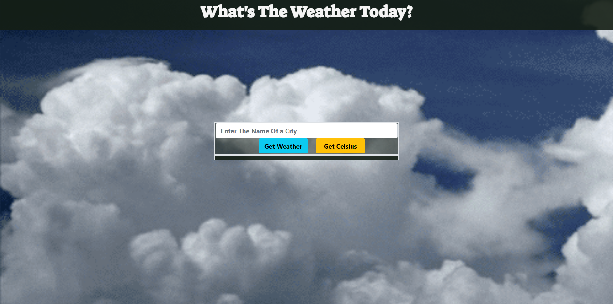

# Javascript Weather App

## Project Description
> This is an app that outputs the weather conditions of any of over 200,000 cities around the world. The app displays the name of the city that the user entered. It also displays the general weather conditions for that city and gives the accurate temperature in fahrenheit or celsius.The user can toggle between fahrenheit or celsius readings. A background gif that corresponds to the weather conditions of the city chosen by the user loads and and fills the screen.



## Live Demo

[Live Demo Link](https://paul-clue.github.io/weatherApp/)

## Built With
> Javascript.
> HTML
> CSS
> webpack


## Getting Started

To get a local copy up and running follow these simple steps.

- Go to the terminal and run the following command:
```
git clone https://github.com/Paul-Clue/weatherApp/tree/feature/proj
```
- If you don't have git, you can download this project and unzip it.
- Change the directory to the folder where you want the application saved.
- Launch the application from index.html.

## Usage
- Once the user has the app loaded up in the browser, the user simply has to enter the name of any city and press the "Get Weather" button. The app will then display the city that the user entered, the general weather conditions of that city, and the city's temperature. The user can also click the "Get Fahrenheit" button or "Get Celsius" button for temperature reading in fahrenheit or celsius.

## Author

👤 **Paul Clue**

- GitHub: [@PaulClue](https://github.com/Paul-Clue)
- LinkedIn: [Paul Clue](https://www.linkedin.com/in/paul-clue/)

## 🤝 Contributing

Contributions, issues and feature requests are welcome!


## Show your support

Give a ⭐️ if you like this project!


## 📝 License

This project is [MIT](LICENSE) licensed.

## Acknowledgments